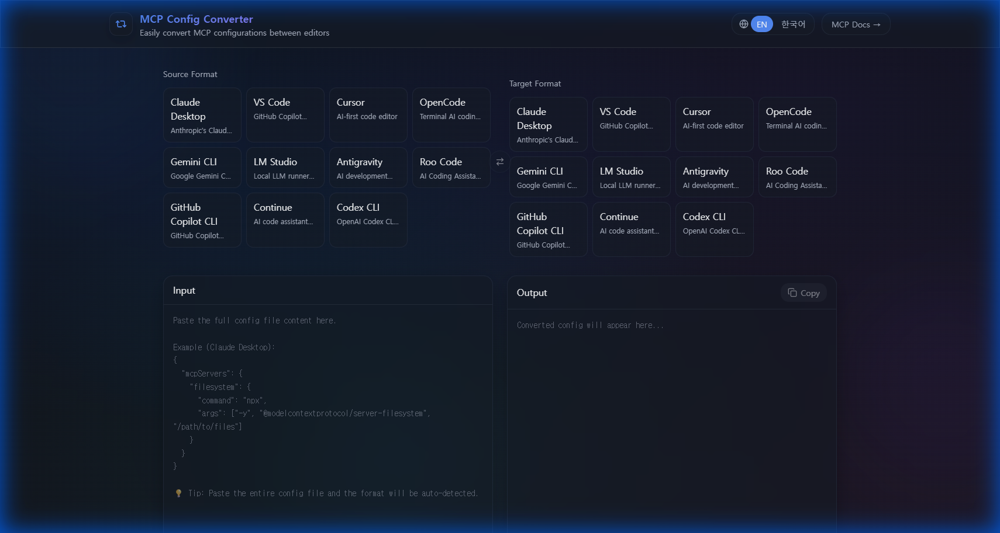
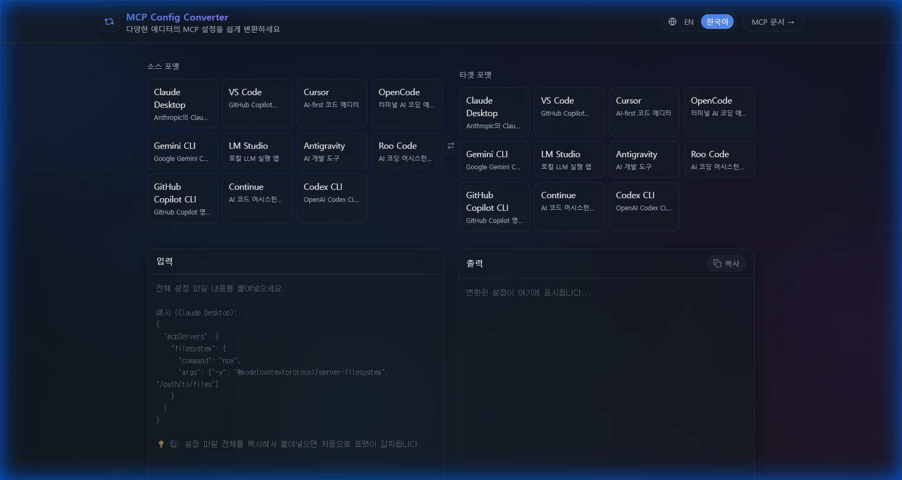

# MCP Config Converter

<p align="center">
  
  
  
  
</p>

<p align="center">
  <strong>Convert MCP (Model Context Protocol) configurations between different AI code editors</strong>
</p>

<p align="center">
  <a href="https://mcpuniv.lovable.app">🚀 Live Demo</a> •
  <a href="#supported-editors">📚 Supported Editors</a> •
  <a href="#features">✨ Features</a>
</p>
<a href="https://www.producthunt.com/products/mcp-2?embed=true&amp;utm_source=badge-featured&amp;utm_medium=badge&amp;utm_campaign=badge-mcp-config-converter" target="_blank" rel="noopener noreferrer"></a>

---

## What is MCP?

[Model Context Protocol (MCP)](https://modelcontextprotocol.io) is an open standard that enables AI assistants to connect with external tools and data sources. Many AI-powered code editors now support MCP, but each has its own configuration format.

**MCP Config Converter** solves this problem by letting you convert your MCP server configurations between different editors instantly.

## Supported Editors

| Editor | Config Format | Config File | Documentation |
|--------|---------------|-------------|---------------|
| **Claude Desktop** | JSON | `claude_desktop_config.json` | [Docs](https://modelcontextprotocol.io/quickstart/user) |
| **VS Code** (GitHub Copilot) | JSON | `.vscode/mcp.json` | [Docs](https://code.visualstudio.com/docs/copilot/chat/mcp-servers) |
| **Cursor** | JSON | `.cursor/mcp.json` | [Docs](https://docs.cursor.com/context/model-context-protocol) |
| **Cline** | JSON | `cline_mcp_settings.json` | [Docs](https://github.com/cline/cline) |
| **Windsurf** | JSON | `~/.codeium/windsurf/mcp_config.json` | [Docs](https://docs.codeium.com/) |
| **OpenCode** | JSON | `opencode.json` | [Docs](https://opencode.ai/docs/mcp) |
| **Gemini CLI** | JSON | `settings.json` | [Docs](https://github.com/google-gemini/gemini-cli) |
| **LM Studio** | JSON | `mcp.json` | [Docs](https://lmstudio.ai/docs/mcp) |
| **Antigravity** | JSON | `mcp_config.json` | [Docs](https://antigravity.dev) |
| **JetBrains Junie / AI Assistant** | JSON | `.junie/mcp/mcp.json` | [Docs](https://www.jetbrains.com/help/idea/ai-assistant.html) |
| **Roo Code** | JSON | `.roo/mcp.json` | [Docs](https://docs.roocode.com/features/mcp/using-mcp-in-roo) |
| **GitHub Copilot CLI** | JSON | `mcp-config.json` | [Docs](https://github.com/github/copilot-cli) |
| **Continue** | YAML | `.continue/mcpServers/*.yaml` | [Docs](https://docs.continue.dev/customize/deep-dives/mcp) |
| **Codex CLI** | TOML | `~/.codex/config.toml` | [Docs](https://openai.com/codex) |
| **Claude Code** | JSON | `.claude.json` | [Docs](https://code.claude.com/docs/mcp) |
| **AmpCode** | JSON | `.amp/settings.json` | [Docs](https://ampcode.com) |
| **Zed** | JSON | `settings.json` | [Docs](https://zed.dev/docs/assistant/model-context-protocol) |
| **Sourcegraph Cody** | JSON | `mcp_servers.json` | [Docs](https://sourcegraph.com/docs/cody/clients/mcp) |
| **Goose** | YAML | `config.yaml` | [Docs](https://block.github.io/goose/docs/getting-started/using-extensions) |
| **LibreChat** | YAML | `librechat.yaml` | [Docs](https://www.librechat.ai/docs/configuration/mcp_servers) |

## Features

- 🔄 **Bidirectional Conversion** - Convert between any supported editor formats
- 🔍 **Auto-Detection** - Automatically detects the source format from pasted config
- 📋 **One-Click Copy** - Copy converted config to clipboard instantly
- 📝 **Example Configs** - Load example configurations for each editor
- 🌐 **Multi-Language** - English and Korean interface
- 🎨 **Glassmorphism UI** - Modern, beautiful glass-effect design
- 📱 **Responsive** - Works on desktop and mobile devices
- ⚡ **Fast & Offline** - All conversions happen in your browser

## Screenshots

<p align="center">
  <strong>English</strong><br/>
  
</p>

<p align="center">
  <strong>한국어</strong><br/>
  
</p>

## Quick Start

### Option 1: Use Online

Visit [mcpuniv.lovable.app](https://mcpuniv.lovable.app) - no installation required!

### Option 2: Run Locally

```bash
# Clone the repository
git clone https://github.com/your-username/mcp-config-converter.git
cd mcp-config-converter

# Install dependencies
npm install

# Start development server
npm run dev
```

## Usage

1. **Select Source Format** - Choose the editor format you're converting from
2. **Select Target Format** - Choose the editor format you're converting to
3. **Paste Configuration** - Paste your MCP config in the input panel
4. **Convert** - Click the "Convert" button
5. **Copy Result** - Copy the converted config and use it in your target editor


## CLI Tool

The project includes a CLI tool `mcpconv` to automatically sync configurations between editors.

### Installation

```bash
# Install globally
npm install -g mcp-config-converter

# Or run directly with npx
npx mcp-config-converter [command]
```

### Commands

#### `sync`
Detects an MCP config file in the current directory and syncs it to installed editors.

```bash
# Sync to all installed editors
mcpconv sync

# Sync to specific editors
mcpconv sync --target claude-desktop,cursor

# Dry run (preview changes)
mcpconv sync --dry-run
```

**Options:**
- `-t, --target <editors...>`: Target specific editors (comma-separated)
- `-d, --dry-run`: Show what would be done without making changes
- `-v, --verbose`: Show detailed output
- `-f, --force`: Overwrite without confirmation

#### `list`
List all installed editors detected on your system and their config file paths.

```bash
mcpconv list
```

#### `editors`
List all supported editors and their default configuration paths.

```bash
mcpconv editors
```

## Example Configurations

### Claude Desktop
```json
{
  "mcpServers": {
    "filesystem": {
      "command": "npx",
      "args": ["-y", "@modelcontextprotocol/server-filesystem", "/path/to/files"]
    }
  }
}
```

### VS Code (GitHub Copilot)
```json
{
  "servers": {
    "filesystem": {
      "command": "npx",
      "args": ["-y", "@modelcontextprotocol/server-filesystem", "/path/to/files"]
    }
  }
}
```

### Cursor
```json
{
  "mcpServers": {
    "filesystem": {
      "command": "npx",
      "args": ["-y", "@modelcontextprotocol/server-filesystem", "/path/to/files"],
      "disabled": false,
      "autoApprove": []
    }
  }
}
```

### Cline
```json
{
  "mcpServers": {
    "filesystem": {
      "command": "npx",
      "args": ["-y", "@modelcontextprotocol/server-filesystem", "/path/to/files"],
      "disabled": false,
      "alwaysAllow": [],
      "autoApprove": []
    }
  }
}
```

### Windsurf
**Path:** `~/.codeium/windsurf/mcp_config.json`

```json
{
  "mcpServers": {
    "filesystem": {
      "command": "npx",
      "args": ["-y", "@modelcontextprotocol/server-filesystem", "/path/to/files"]
    }
  }
}
```

## Format Differences

Each editor has unique configuration features:

| Editor | Root Key | Format | Type Field | Timeout | Special Fields |
|--------|----------|--------|------------|---------|----------------|
| Claude Desktop | `mcpServers` | JSON | ❌ | ❌ | — |
| VS Code | `servers` | JSON | ✅ | ❌ | `envFile`, `cwd` |
| Cursor | `mcpServers` | JSON | ❌ | ❌ | `autoApprove`, `disabled` |
| Cline | `mcpServers` | JSON | ❌ | ❌ | `alwaysAllow`, `autoApprove` |
| Windsurf | `mcpServers` | JSON | ❌ | ❌ | — |
| OpenCode | `mcp` | JSON | ✅ (`local`/`remote`) | ❌ | Command as array, `enabled` |
| Gemini CLI | `mcpServers` | JSON | ❌ | ✅ | `httpUrl`, `trust`, `includeTools` |
| LM Studio | `mcpServers` | JSON | ❌ | ❌ | — |
| Antigravity | `mcpServers` | JSON | ❌ | ❌ | `serverUrl` |
| Junie | `mcpServers` | JSON | ❌ | ❌ | — |
| Roo Code | `mcpServers` | JSON | ❌ | ❌ | `alwaysAllow`, `disabled` |
| Copilot CLI | `servers` | JSON | ❌ | ❌ | Same structure as VS Code |
| Continue | `mcpServers` (array) | YAML | ✅ | ❌ | Array-based, `name` field |
| Codex CLI | `mcp_servers` | TOML | ❌ | ✅ (`startup_timeout_sec`) | — |
| Claude Code | `mcpServers` | JSON | ❌ | ❌ | `allowedMcpServers` |
| AmpCode | `amp.mcpServers` | JSON | ✅ | ❌ | — |
| Zed | `context_servers` | JSON | ❌ | ❌ | — |
| Sourcegraph Cody | `mcpServers` | JSON | ❌ | ❌ | — |
| Goose | `extensions` | YAML | ✅ | ✅ (seconds) | `cmd`, `envs`, `enabled` |
| LibreChat | `mcpServers` | YAML | ✅ | ✅ (ms) | — |

**Key Differences:**
- **VS Code / Copilot CLI** use `servers` as the root key instead of `mcpServers`
- **Zed** uses `context_servers` as the root key
- **AmpCode** uses `amp.mcpServers` (dotted key)
- **Goose** uses `extensions` with `cmd`/`envs` instead of `command`/`env`
- **Continue** uses an array of server objects (with `name` field), not a key-value map
- **Codex CLI** uses TOML format with underscore naming (`mcp_servers`)
- **Claude Code** adds `allowedMcpServers`/`deniedMcpServers` access control lists
- **Cline** supports both `alwaysAllow` and `autoApprove`; **Cursor** only has `autoApprove`
- **OpenCode** supports command as array and uses `mcp` as root key

## Tech Stack

- **Framework:** React 18 + TypeScript
- **Styling:** Tailwind CSS + shadcn/ui
- **i18n:** react-i18next
- **Build:** Vite
- **Deployment:** Lovable

## Contributing

Contributions are welcome! Please feel free to submit a Pull Request.

1. Fork the repository
2. Create your feature branch (`git checkout -b feature/amazing-feature`)
3. Commit your changes (`git commit -m 'Add some amazing feature'`)
4. Push to the branch (`git push origin feature/amazing-feature`)
5. Open a Pull Request

## License

This project is open source and available under the [MIT License](LICENSE).

## Acknowledgments

- [Model Context Protocol](https://modelcontextprotocol.io) by Anthropic
- All the AI code editor teams for building MCP support

---

<p align="center">
  Made with ❤️ by the community
</p>
